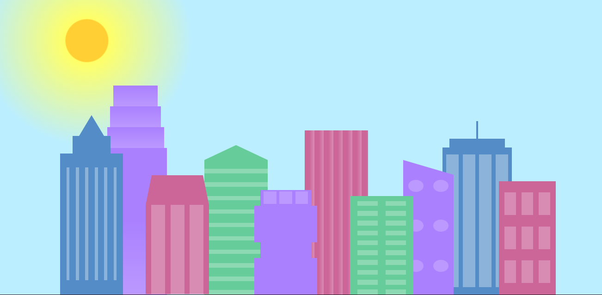

# City Skyline

🔗 [Click here to access](https://carvmi.github.io/cssvariables/)
## Technologies 
- HTML
- CSS

## What I have learned
 - Use the * selector, and give it a border of 1px solid black is a trick that helps visualize where elements are and their size. However, it is removed later.
-  Hide any scroll bars that appear when something extends past the viewport by setting the overflow property of the body element to hidden
- Variable declarations begin with two dashes (-) and are given a name and a value like this: --variable-name: value;
- To use a variable, put the variable name in parentheses with var in front of them like this: var(--variable-name).;
- Add a fallback value to a variable by putting it as the second value of where you use the variable like this: var(--variable-name, fallback-value)
- The main advantage of using variables is being able to quickly change many values in your stylesheet by just changing the value of a variable.
- Variables are often declared in the :root selector. This is the highest level selector in CSS; putting your variables there will make them usable everywhere. 
- Change the gradient type from linear-gradient to repeating-linear-gradient will make the four colors of the gradient repeat until it gets to the bottom of the element.
- CSS borders turn the .bb2a section into a triangle at the top of the building
  border-bottom: 5vh solid var(--building-color2);
  border-left: 5vw solid transparent;
  border-right: 5vw solid transparent;
- The gradient's default direction goes from top to bottom, however, you can specify another direction by adding it before your colors 
- Make .window-wrap a flexbox container, and use the align-items and justify-content properties to center its child elements vertically and evenly space them in their parent, respectively, when the windows are stacked on top of each other at the left of the section, behind the purple building. 
- Add  building-wrap class to center the sections.
- Add  window-wrap class to center and space the windows.
- At the top of the sky gradient color list, where you would put a direction for the gradient; add circle closest-corner at 15% 15%,. This will move the start of the gradient to 15% from the top and left. It will make it end at the closest-corner and it will maintain a circle shape.
- A media query can be used to change styles based on certain conditions.
- Copy and paste your whole sky class along with all of its properties and values into the media query. You are going to make another color scheme for the skyline that changes it from day to night.

## Contact
milenadecarvalho2000@gmail.com
